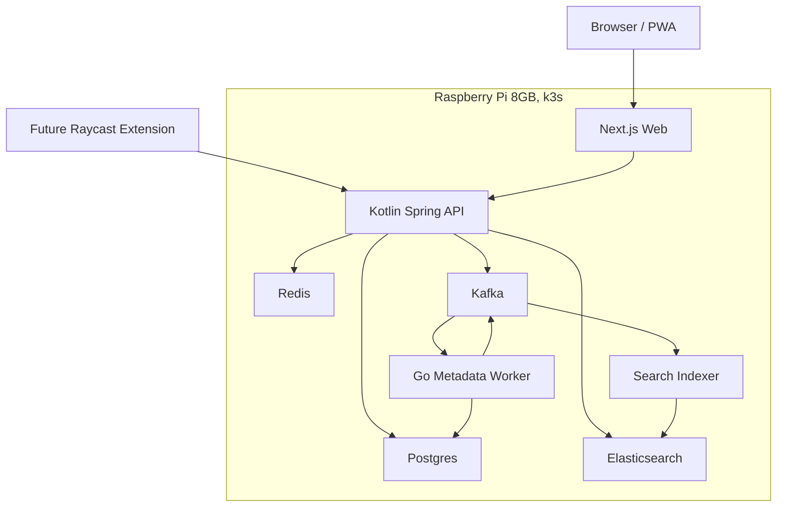

# Bookmarket V2 Rewrite Plan

## Objective

Rewrite Bookmarket internals completely while preserving v1 user-facing behavior and UI during the parity phase.

The success condition is not "v2 is architecturally cleaner." The success condition is:

> A v1 user can use v2 and notice no difference in existing UI, routes, flows, and features.

New capabilities such as marketplace listings, purchases, Raycast extensions, Elasticsearch-powered discovery, and richer collection models must be designed into the architecture, but hidden until v1 parity is proven.

## Current Constraints

- Existing source of truth for behavior: `/Users/ericpark/Desktop/Projects/bookmarket`
- New rewrite target: `/Users/ericpark/Desktop/Projects/bookmarket-v2`
- Production target: single 8GB Raspberry Pi
- Runtime target: k3s on the Pi
- Infrastructure target: Terraform-managed Kubernetes resources
- Primary database: Postgres
- Async event/job system: Kafka
- Cache/fast operational state: Redis
- Search index: Elasticsearch
- Main backend: Kotlin Spring Boot
- Metadata worker: Go
- Web app: Next.js, visually identical to v1 during parity

## Non-Goals During V1 Parity

- No visual redesign.
- No visible marketplace UI.
- No changed route names.
- No changed interaction patterns.
- No changed copy unless required for security or correctness.
- No hidden entity leakage or auth shortcuts copied from v1.
- No direct ORM/entity responses from the API.

## Target Architecture



## Service Boundaries

### `apps/web`

Responsibilities:
- Preserve the v1 UI and route behavior.
- Render current flows: landing, login, signup, home, shared profile.
- Call the API through stable contracts.
- Keep marketplace implementation details out of UI internals until product work starts.

Must not:
- Fetch metadata directly.
- Know database shape.
- Depend on Kafka, Redis, or Elasticsearch directly.

### `services/api`

Responsibilities:
- Own authentication, authorization, and external API contracts.
- Own writes to Postgres.
- Publish Kafka events after successful transactions.
- Serve browser and future Raycast clients.
- Provide DTOs, not persistence entities.

Core modules:
- Auth
- Users
- Bookmarks
- Categories
- Collections
- Public profiles and subdomains
- Search query facade
- Marketplace-ready listings and access grants, hidden initially

### `services/metadata-worker`

Responsibilities:
- Consume metadata fetch requests from Kafka.
- Fetch title, description, favicon, canonical URL.
- Enforce SSRF protections.
- Retry safely and publish success/failure events.
- Update metadata without blocking bookmark creation.

Must be:
- Idempotent
- Timeout bounded
- Observable
- Safe against localhost/private network targets

### Search Indexer

Initial version can be part of `services/api`; split later only if load or complexity requires it.

Responsibilities:
- Consume indexing events.
- Write derived documents to Elasticsearch.
- Support full rebuild from Postgres.

## Data Ownership

Postgres is the only source of truth.

Kafka is an event transport and replay source for derived work.
Redis is operational state/cache.
Elasticsearch is a derived search index.

If Redis, Kafka, or Elasticsearch loses data, the system should be recoverable from Postgres plus controlled replay/rebuild processes.

## Initial Data Model Plan

V1 parity tables:
- `users`
- `auth_accounts`
- `refresh_tokens`
- `api_tokens`
- `bookmarks`
- `bookmark_metadata`
- `categories`
- `public_profiles`

Marketplace-ready tables, hidden from UI at first:
- `collections`
- `collection_items`
- `marketplace_listings`
- `listing_versions`
- `purchases`
- `access_grants`

Important modeling rules:
- A bookmark is a private saved URL.
- A collection is an ordered set of bookmarks.
- A listing is a sellable product derived from a collection.
- A purchase grants access to a versioned snapshot, not mutable owner state.
- Public profiles and marketplace listings must not leak private bookmarks.

## Kafka Topic Plan

Initial topics:

- `bookmark.events`
- `metadata.jobs`
- `metadata.events`
- `search.jobs`

Required event envelope:

```json
{
  "eventId": "uuid",
  "eventType": "metadata.fetch.requested",
  "eventVersion": 1,
  "occurredAt": "2026-05-15T00:00:00Z",
  "producer": "services/api",
  "idempotencyKey": "bookmark:{bookmarkId}:metadata:{version}",
  "payload": {}
}
```

Initial event types:
- `bookmark.created`
- `bookmark.updated`
- `bookmark.deleted`
- `metadata.fetch.requested`
- `metadata.fetch.completed`
- `metadata.fetch.failed`
- `search.index.requested`
- `search.delete.requested`

Consumer requirements:
- Idempotent handling.
- Bounded retries.
- Dead-letter path.
- Traceable logs.
- Metrics for lag and failure count.

## Redis Usage Plan

Use Redis where invalidation and lifetime are clear.

Initial uses:
- Rate limiting.
- OAuth state and PKCE verifier storage.
- Idempotency keys for mutation requests.
- Metadata job status cache.
- Hot public profile response cache.

Do not initially cache:
- Every private bookmark list.
- Primary ownership or permission state.
- Marketplace purchase access decisions unless invalidation is designed.

## Elasticsearch Usage Plan

Use Elasticsearch as a derived index.

Initial parity mode:
- Preserve current command-menu behavior.
- Personal search can be API-backed, but visible behavior must match v1.

Future marketplace mode:
- Index public collections and listings.
- Support full-text search, tags, categories, creator, price, popularity, recency.
- Rebuild index from Postgres.

Failure mode:
- If Elasticsearch is unavailable, personal bookmark search should degrade to Postgres search.
- Marketplace discovery can show a controlled error or limited fallback.

## Kubernetes And Terraform Plan

Runtime:
- Single-node k3s on 8GB Raspberry Pi.
- Terraform uses the Kubernetes provider to define resources.
- GHCR stores ARM64 images.
- GitHub Actions builds and deploys.

Terraform manages:
- Namespaces
- Deployments
- StatefulSets
- Services
- Ingress
- ConfigMaps
- Secret references
- Persistent volume claims
- Resource requests/limits
- Probes
- Rolling update strategy

Initial Pi resource profile:

| Component | Replicas | Request | Limit |
| --- | ---: | ---: | ---: |
| web | 1 | 256Mi | 512Mi |
| api | 1 | 512Mi | 1Gi |
| metadata-worker | 1 | 128Mi | 256Mi |
| postgres | 1 | 512Mi | 1Gi |
| redis | 1 | 128Mi | 256Mi |
| kafka | 1 | 768Mi | 1Gi |
| elasticsearch | 1 | 1.5Gi | 2Gi |

Scale-up path:
- Raise `web` and `api` to 2 replicas if memory remains stable.
- Keep Postgres, Kafka, Redis, and Elasticsearch single-instance on the Pi.

Reality check:
- This setup has process self-healing and rolling updates.
- It does not have hardware high availability.
- If the Pi dies, production is down.

## TDD And Verification Strategy

Testing order matters more than test count.

### 1. Characterization Tests

Capture v1 before building v2:
- Playwright screenshots.
- Route behavior notes.
- API response shape notes.
- Seeded user/bookmark/category data.

These tests define "do not break existing behavior."

### 2. Contract Tests

Before service implementation:
- API DTO contracts.
- Error shape contract.
- Kafka event schema contract.
- Auth/session contract.

### 3. Backend Integration Tests

Use Testcontainers for:
- Postgres
- Kafka
- Redis
- Elasticsearch

Test:
- Bookmark creation commits before metadata fetch.
- Metadata request event is published.
- Metadata worker is idempotent.
- Search index can rebuild from Postgres.
- Authorization never leaks another user's private data.

### 4. Visual Regression Tests

Required routes:
- `/`
- `/login`
- `/signup`
- `/home`
- `/s/[username]`

Required viewports:
- 1440x1000
- 834x1112
- 390x844

### 5. Deployment Tests

Before Pi production:
- Terraform plan is reviewed.
- Images build for `linux/arm64`.
- k3s rollout finishes.
- Probes pass.
- Persistent volumes survive pod restart.

## Migration Plan

1. Inventory v1 Postgres schema and production data.
2. Create v2 schema migrations from scratch.
3. Build read-only v1 export script.
4. Build v2 import script.
5. Validate counts and ownership:
   - users
   - bookmarks
   - categories
   - public profiles
   - metadata fields
6. Run v1 and v2 against equivalent seed data.
7. Compare screenshots and API behavior.
8. Freeze writes briefly for final production migration.
9. Import into v2.
10. Switch traffic after smoke tests.

## Phase Plan

### Phase 0: Planning Freeze

Deliverables:
- This rewrite plan.
- Agent ToC.
- V1 parity checklist.
- Architecture docs.
- Open decision list.

Exit criteria:
- You approve the plan.
- No implementation starts before approval.

### Phase 1: V1 Characterization

Deliverables:
- Playwright baseline project.
- Seed data specification.
- Screenshot baseline.
- Current API behavior notes.

Exit criteria:
- V1 behavior is documented enough to prevent accidental UI/product drift.

### Phase 2: Contracts And Schema

Deliverables:
- API contract.
- Event contract.
- Error contract.
- Initial Postgres schema.
- Migration strategy.

Exit criteria:
- Web/API/worker can be developed against contracts.

### Phase 3: Infrastructure Skeleton

Deliverables:
- Local Docker Compose.
- Terraform k3s modules.
- GitHub Actions ARM64 build plan.
- Resource limits.

Exit criteria:
- Empty services can deploy to k3s.

### Phase 4: Service Skeletons

Deliverables:
- Next.js app shell.
- Kotlin API shell.
- Go worker shell.
- Health checks.
- Basic CI.

Exit criteria:
- All services build and pass health checks.

### Phase 5: V1 Feature Parity

Implementation order:
1. Auth/session.
2. Users/profile/subdomain.
3. Bookmarks CRUD.
4. Categories.
5. Public profiles.
6. Async metadata pipeline.
7. Command menu/search parity.

Exit criteria:
- Visual regression passes.
- Integration tests pass.
- V1 parity checklist passes.

### Phase 6: Production Migration

Deliverables:
- Import/export scripts.
- Pi deployment.
- Rollback plan.
- Production smoke checks.

Exit criteria:
- V2 can replace v1 without visible regression.

### Phase 7: Marketplace Foundations

Deliverables:
- Collection/listing/access-grant APIs.
- Hidden marketplace schema usage.
- Search indexing for public collections.

Exit criteria:
- Marketplace feature can be built without reworking the core model.

## Open Decisions

These need explicit approval before implementation:

1. Should Postgres, Kafka, Redis, and Elasticsearch all run inside k3s on the Pi, or should any be external/managed?
2. Should search indexing live inside the Kotlin API first, or start as a separate service?
3. Should the web app be copied from v1 first, or rebuilt component-by-component against screenshot baselines?
4. Should marketplace tables exist in the first schema migration even if no UI uses them?
5. Should Raycast auth use personal access tokens first, or OAuth device flow?

## Immediate Next Step After Approval

Start Phase 1 only:

1. Inspect v1 routes and states.
2. Define deterministic seed data.
3. Add Playwright characterization test plan.
4. Capture baseline screenshots.
5. Produce a v1 behavior report.

No service implementation should start before Phase 1 exits.
